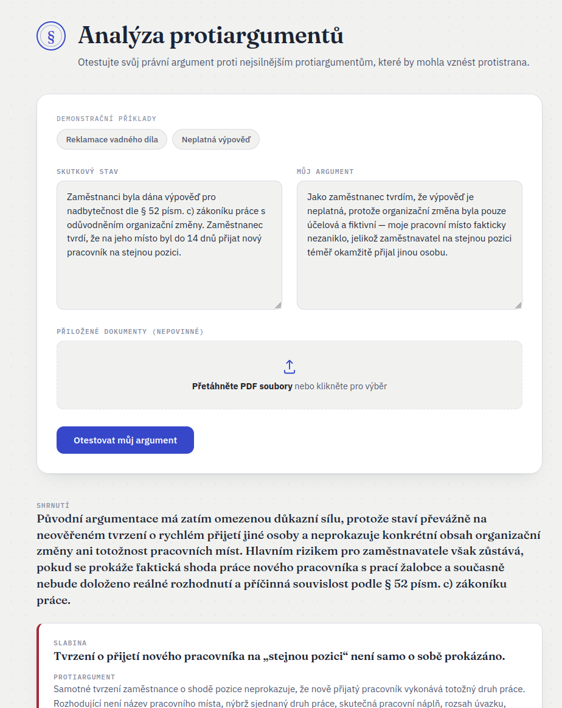
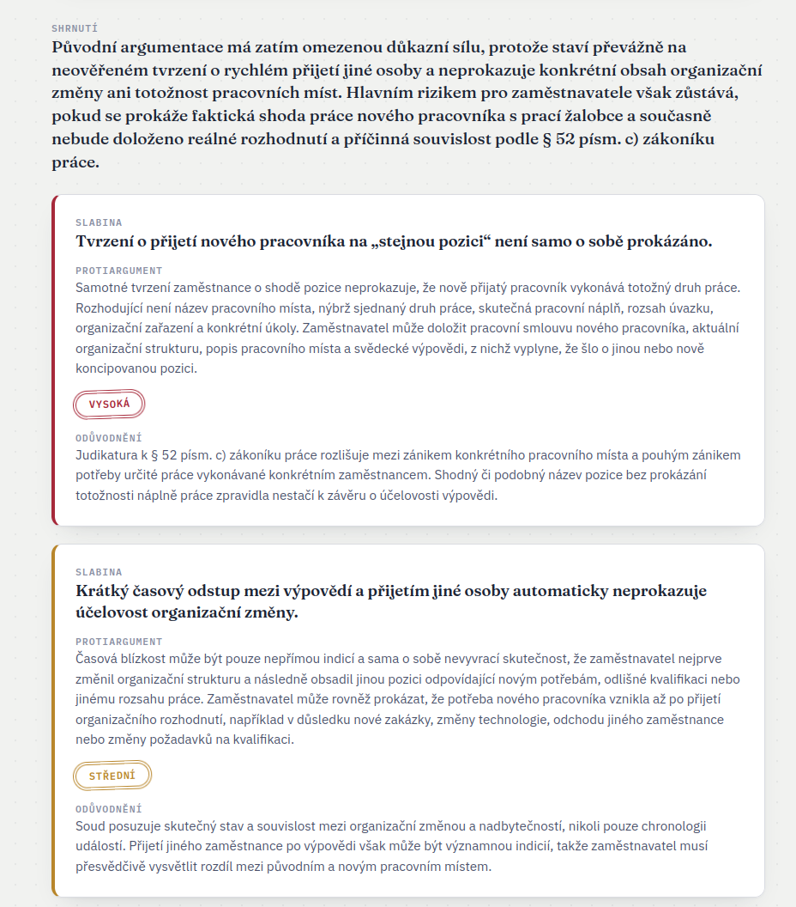

# Analýza protiargumentů

*[English version](README.md)*

PoC nástroj, který otestuje právní argument proti nejsilnějším protiargumentům,
jaké by mohla vznést protistrana. Uživatel zadá skutkový stav a svůj vlastní
argument (volitelně i s přiloženými PDF dokumenty) a reasoning model (OpenAI,
např. GPT-5.5) nejprve najde slabiny v argumentaci a následně z každé slabiny
zformuluje protiargument protistrany s odhadem jeho síly a odůvodněním.

## Ukázka

**Vstupní formulář** — skutkový stav, vlastní argument, nepovinné PDF přílohy
a dva demonstrační příklady pro rychlé vyzkoušení:



**Výsledek analýzy** — shrnutí rizika a karty s jednotlivými slabinami,
protiargumenty, odhadem síly a odůvodněním:



## Jak aplikace funguje

Analýza probíhá ve dvou fázích, které na sebe navazují a streamují se do UI
v reálném čase přes Server-Sent Events:

1. **Fáze 1 — hledání slabin.** Model dostane skutkový stav a argument
   uživatele a v roli právního analytika identifikuje 3–5 nejslabších míst
   argumentace (nepodložená tvrzení, sporné právní kvalifikace, chybějící
   důkazy, alternativní výklady normy).
2. **Fáze 2 — protiargumentace.** Model se přepne do role advokáta
   protistrany a ke každé nalezené slabině zformuluje nejsilnější reálný
   protiargument, ohodnotí jeho sílu (`low` / `medium` / `high`), přidá
   stručné odůvodnění a na závěr celkové shrnutí rizika.

Obě fáze streamují dílčí položky (JSON pole) ihned, jak je model dokončí —
uživatel tak vidí slabiny a protiargumenty postupně se objevovat, ne až po
skončení celé generace.

## Funkce (features)

- **Dvoufázová AI analýza** — nejdřív slabiny, pak protiargumenty s odhadem
  síly (nízká/střední/vysoká) a odůvodněním, na závěr celkové shrnutí.
- **Streamované výsledky (SSE)** — průběžný progress bar, uplynulý čas a
  karty slabin/protiargumentů se plní živě, bez čekání na celou odpověď.
- **Nahrání PDF příloh** — drag & drop nebo výběr souboru, libovolný počet
  PDF; text se z nich vytáhne (pypdf) a připojí ke skutkovému stavu.
- **Automatická extrakce skutkového stavu z PDF** — tlačítko "Vytáhnout
  skutkový stav z PDF" nechá menší/rychlejší model (`gpt-5.4-nano`) shrnout
  jen fakta z nahraných dokumentů (výpověď, smlouva, žaloba…) do pole
  skutkového stavu, bez právního hodnocení.
- **Demonstrační příklady** — dvě přednastavené kauzy (reklamace vadného
  díla, neplatná výpověď) pro okamžité vyzkoušení bez psaní vlastního textu.
- **Ošetření chyb** — chyba v kterékoli fázi streamu (např. výpadek OpenAI
  API) se zobrazí uživateli jako srozumitelná hláška, spojení se navíc
  kontroluje na předčasné přerušení.

## Architektura

```
frontend (React 19 + Vite + TypeScript)
   │  fetch + Server-Sent Events
   ▼
backend (FastAPI, async)
   │  OpenAI Responses API (streamované structured output, JSON schema)
   ▼
OpenAI (reasoning model, např. gpt-5.5 / gpt-5.6-terra)
```

- **Backend** (`backend/app`): FastAPI aplikace. `main.py` definuje
  endpointy, `openai_client.py` volá OpenAI Responses API se strict JSON
  schématem a pro streamovaný endpoint inkrementálně parsuje pole položek
  z (`streaming_json.py`) ještě před dokončením celé odpovědi.
  `pdf_extract.py` extrahuje text z PDF (pypdf), `sse.py` formátuje SSE
  eventy. Prompty jsou v `backend/tools/prompts/` (fáze 1, fáze 2, extrakce
  skutkového stavu).
- **Frontend** (`frontend/src`): `ArgumentForm` (vstupní formulář, upload,
  demo příklady), `LoadingState` (progress bar dle fáze), `AnalysisCard` /
  `ResultCards` (zobrazení slabin a protiargumentů), `api/client.ts`
  (parsování SSE streamu).

## Spuštění

### Docker

```bash
cp backend/.env.example backend/.env  # doplňte OPENAI_API_KEY
docker compose up --build
```

Otevřete `http://localhost:5173` — stejné porty a CORS nastavení jako při
lokálním vývoji, jen kontejnerizované, takže prohlížeč komunikuje s
frontendem a backendem přímo na jejich portech.


### Konfigurace (`backend/.env`)

| Proměnná                 | Význam                                                        | Výchozí         |
|---------------------------|----------------------------------------------------------------|-----------------|
| `OPENAI_API_KEY`          | API klíč OpenAI (povinné)                                     | —               |
| `OPENAI_MODEL`            | Reasoning model pro fáze 1 a 2 (hledání slabin, protiargumenty) | `gpt-5.5`       |
| `OPENAI_REASONING_EFFORT` | Úroveň reasoning efforu (`low` / `medium` / `high`)             | `high`          |
| `OPENAI_EXTRACTION_MODEL` | Rychlejší model pro extrakci skutkového stavu z PDF             | `gpt-5.4-nano`  |

## Testy (backend)

```bash
cd backend
source .venv/bin/activate
pytest -v
```

Testy pokrývají API endpointy, OpenAI klienta, extrakci PDF, prompty,
schémata, SSE formátování a inkrementální JSON parsování streamu.

## Licence

[MIT](LICENSE)
